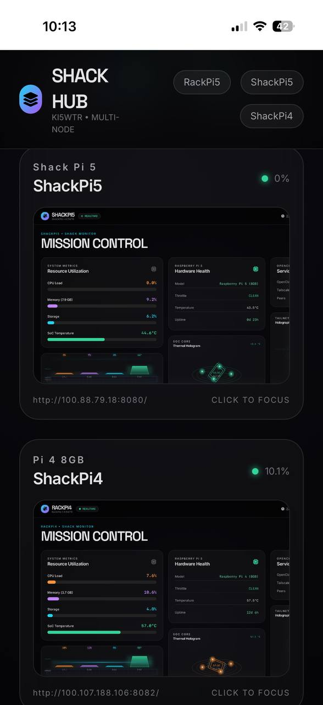

# Shack Hub

Multi-node dashboard for KI5WTR shack (RackPi5, ShackPi4, ShackPi5).

Built with Python + simple HTML/JS frontend.

## Screenshot



## Running

The live instance is at the Pi nodes (see hosts.json).

## Configuration

Edit `hosts.json` to change the nodes, names, roles, and URLs:

```json
{
  "title": "SHACK HUB",
  "hosts": [
    { "id": "yourpi", "name": "My Pi", "role": "Description", "url": "http://100.x.x.x:8080" }
  ]
}
```

The server runs on port 8081 by default (see `serve.py` if you need to change it).

## Running

```bash
python3 serve.py
```

## License

MIT
